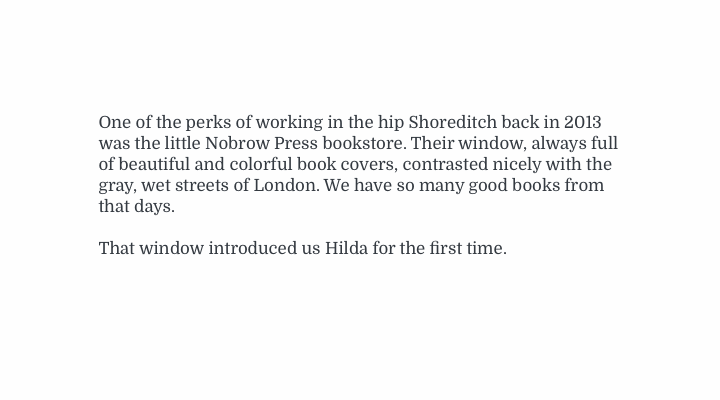

# sketch-truncate-textlines

**Shortcut:** ctrl alt cmd t

Cut the number of lines of a textbox, adding an ellipsis if needed. It works using words or characters. Most of the ideas are taken from the [sketch data populator plugin](https://github.com/preciousforever/sketch-data-populator/).

